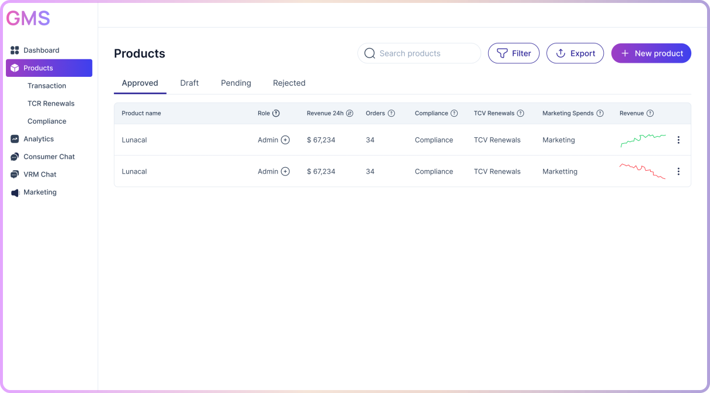

# GMS - Global Marketplace for SaaS

An AI-powered SaaS marketplace platform connecting vendors with verified, high-intent buyers. Built with Next.js 16, React 19, and Tailwind CSS 4.



## 🚀 Features

### For Vendors
- **AI-Powered Matching**: Connect with verified buyers using intelligent matching algorithms
- **Product Listing Management**: Easy-to-use multi-step product listing form
- **Analytics Dashboard**: Track revenue, orders, and performance metrics
- **Compliance Management**: Built-in compliance tracking (GDPR, SOC2)
- **Pricing Plans**: Flexible subscription, usage-based, and license pricing models
- **Media Management**: Upload product images, videos, and documentation

### Platform Features
- Responsive design for all devices
- Real-time draft saving with localStorage
- Rich text editor for product descriptions
- Integration management system
- Multi-tier pricing support
- SEO-optimized landing pages

## 📋 Prerequisites

- Node.js 20.x or higher
- npm, yarn, pnpm, or bun

## 🛠️ Installation

1. Clone the repository:
```bash
git clone <your-repo-url>
cd gms
```

2. Install dependencies:
```bash
npm install
# or
yarn install
# or
pnpm install
```

3. Run the development server:
```bash
npm run dev
# or
yarn dev
# or
pnpm dev
```

4. Open [http://localhost:3000](http://localhost:3000) in your browser

## 📁 Project Structure

```
gms/
├── app/                          # Next.js App Router
│   ├── dashboard/               # Dashboard pages
│   │   ├── products/           # Product management
│   │   │   ├── new/           # Multi-step product form
│   │   │   └── debug-storage/ # LocalStorage debugging
│   │   ├── finance/
│   │   ├── compliance/
│   │   └── roles/
│   ├── website/                # Public website pages
│   ├── layout.tsx              # Root layout
│   ├── page.tsx               # Landing page
│   └── globals.css            # Global styles
├── components/
│   ├── CTA/                    # Call-to-action section
│   ├── Dashboard/              # Dashboard components
│   │   ├── DashboardLayout.tsx
│   │   ├── Header.tsx
│   │   └── Sidebar.tsx
│   ├── FAQ/                    # FAQ section
│   ├── Footer/                 # Footer component
│   ├── Header/                 # Navigation header
│   ├── Hero/                   # Hero section
│   ├── HowItWorks/            # How it works section
│   ├── Problems/              # Problem statement section
│   ├── ProductForm/           # Multi-step product form
│   │   ├── BasicDetails.tsx
│   │   ├── Features.tsx
│   │   ├── PlansAndPricing.tsx
│   │   └── RichTextEditor.tsx
│   ├── Solution/              # Solution section
│   ├── SocialProof/          # Social proof section
│   └── ui/                    # Reusable UI components
│       ├── button.tsx
│       ├── container.tsx
│       └── heading.tsx
├── lib/
│   └── utils/                 # Utility functions
│       └── index.ts          # cn() helper
└── public/                    # Static assets
```

## 🎨 Tech Stack

- **Framework**: [Next.js 16](https://nextjs.org/)
- **React**: 19.2.0
- **Styling**: [Tailwind CSS 4](https://tailwindcss.com/)
- **UI Components**: Custom components with [class-variance-authority](https://cva.style/)
- **Icons**: [Lucide React](https://lucide.dev/)
- **TypeScript**: Full type safety
- **Linting**: ESLint with Next.js config

## 🔧 Available Scripts

```bash
# Development
npm run dev          # Start dev server

# Production
npm run build        # Build for production
npm run start        # Start production server

# Linting
npm run lint         # Run ESLint
```

## 🎯 Key Features Implementation

### Multi-Step Product Form
The product listing form includes:
- **Step 1**: Basic details with PDF autofill
- **Step 2**: Features, media, documentation, and integrations
- **Step 3**: Plans & pricing configuration
- **Step 4**: Compliance (coming soon)
- **Step 5**: Preview
- **Step 6**: Payment (coming soon)

### State Management
- LocalStorage-based draft saving
- Real-time form data persistence
- Step progress tracking
- Draft products listing in dashboard

### UI Components
Custom components built with CVA for consistent styling:
- `Button` - Multiple variants (default, ghost, icon)
- `Container` - Responsive container wrapper
- `Heading` - Typography with size variants

### Utility Functions
- `cn()` - Tailwind class merging with clsx

## 📄 License

This project is private and proprietary.

## 👥 Team

- **Developer**: Abhinav Sinha

---

Built with ❤️ using Next.js and Tailwind CSS
